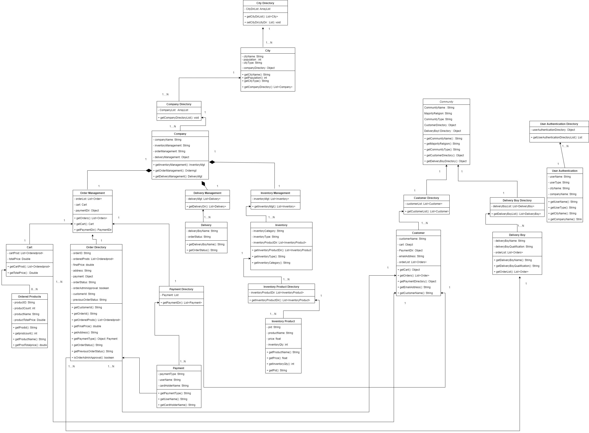

Click2Cart is an E-Commerce Clone Java Swing Application.

It consists:
4 Enterprises
6 Organisations
8 Roles

The Technologies used to build this project are:
1. JDK 18
2. Netbeans IDE 14
3. Build Tool: Maven
4. Database (MySQl)
5. Maps API (JOpenCage)
6. SMTP
7. Git

The UML Diagrams for Click2Cart are as follows:

Class Diagram

Sequence Diagram
